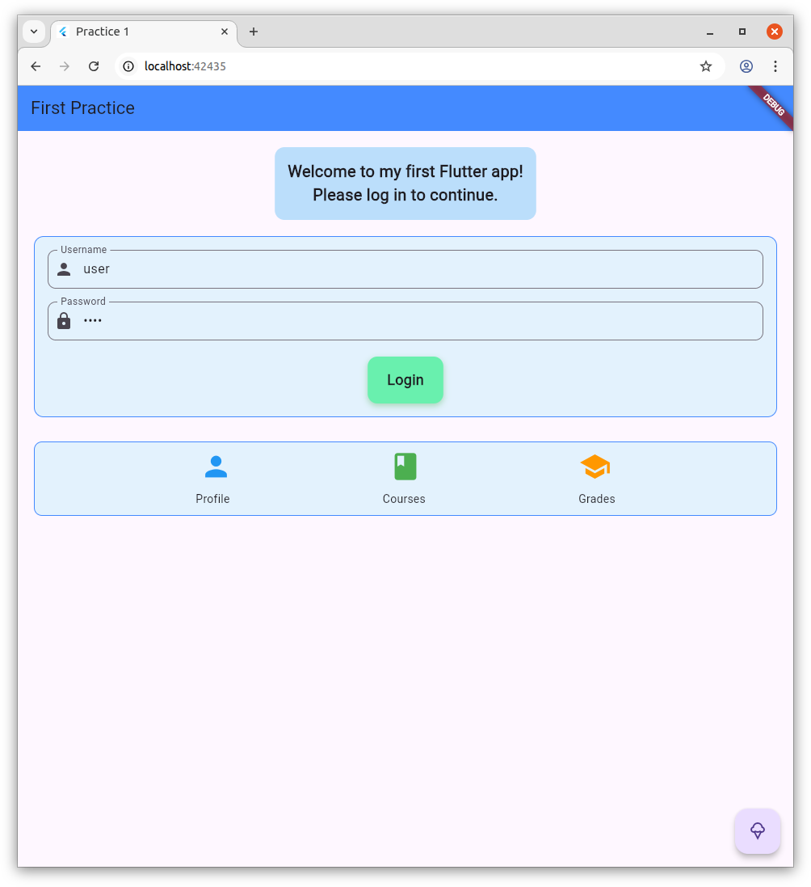
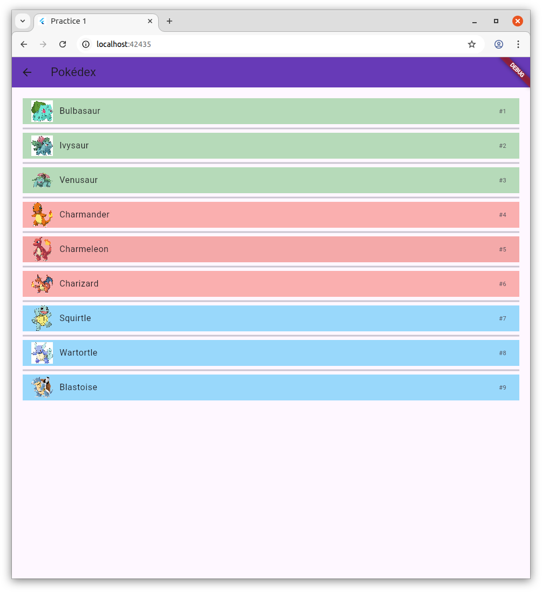
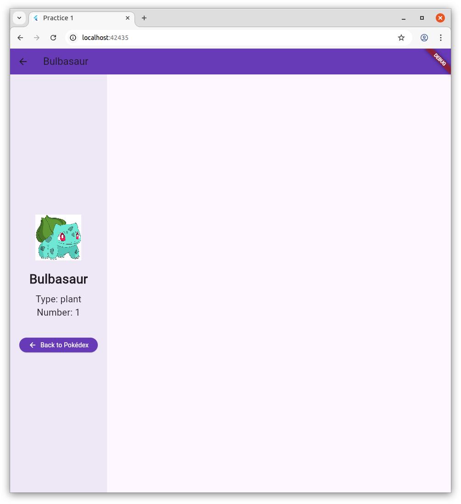

# Práctica 2 - Flutter Pokédex

**Autores:** Oussama Taryous, Iliass El Kamili y Ayman Lezhar

Este repositorio contiene la solución a la Práctica 2 de IPC, que consiste en una aplicación Flutter estilo Pokédex con autenticación, navegación con iconos y detalle de cada ítem. La app cumple con los requisitos del entregable publicados en los enlaces oficiales.

## Características

- Pantalla de login para acceder a la app.
- Visualización de una lista de Pokémon con nombre, icono y número.
- Acceso al detalle de cada Pokémon pulsando sobre el item.
- Interfaz atractiva usando Material Design y colores diferenciados por tipo.

## Instalación y ejecución

1. Clona este repositorio y entra al directorio del proyecto:
   git clone <URL-del-repo>
   cd <nombre-del-repo>
2. Instala las dependencias:
   flutter pub get
3. Lanza la app en Chrome con el terminal:
   flutter run -d chrome
   Para producción, añade --release:
   flutter run -d chrome --release
4. Al acceder vía Chrome:
   - Rellena los campos del login.
   - Aparecerá la lista con iconos y items pulsables.
   - Pulsa un item para ver el detalle ampliado.

## Imágenes del flujo de la app

> Comentario: Añade aquí las tres imágenes adjuntas para mostrar el login, la lista y el detalle. Ejemplo:
>
> 
> 
> 
>

## Tecnologías empleadas

- Flutter (Dart)
- Ejecución en navegador Chrome usando Flutter web
- Interfaz responsive
